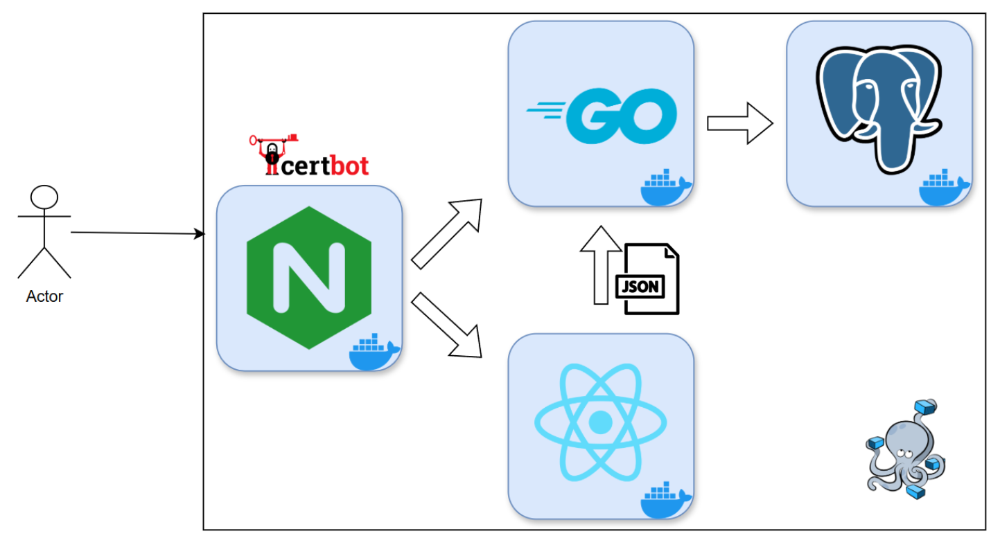

# Data Markup

## Описание
Сервис предназначен для разметки датасетов большим количеством ассессоров. Сервис дает возможность создавать
пользовательские разметки, загружать датасеты в формате csv, просматривать статистику по различным разметкам 
в датасете, выгружать результаты и создавать ханипоты.

Сервис доступен по адресу [rwfshr.ru](https://rwfshr.ru)

## Примеры

### Добавление типа разметки
Тип разметки - это набор полей, который видят ассессоры. Есть несколько типов: radio, checkbox, select, multiselect, text.

### Добавление проекта
У проекта можно указать приоритет: задания проектов с высоким приоритетом появляются в выдаче у ассессоров чаще, чем
задания проектов приоритета ниже. Задание проекта становится оцененным, когда его оценивает администратор, или набирается
N одинаковых оценок, где N - это количество пересечений.

После создания проекта, можно будет отредактировать его разметку, это действие сохранится в истории.

### Создание ханипота
Задание с эталонной оценкорй можно сделать ханипотом. Ханипот - это отдельный проект, который имеет высокий приоритет.
Он выдается всем ассессорам, чтобы оценить их работу на этом задании.

### Оценка
После регистрации пользователь автоматически становися ассессором. Он может оценивать задания проектов, поставленных
в работу. В личном кабинете ассессор может просматривать свою статистику и изменять оценку, если после ее создания прошло 
меньше 30 минут.

### Результат
На странице проекта можно посмотреть прогресс по проекту, статистику оценок по истории разметок, оценки конкретных заданий, 
изменить верную оценку и выгрузить результат в формате csv.

## Инфраструктура
Проект развернут с помощью docker compose, сертификаты ssl получены при помощи certbot. Всего в проекте 4 docker-контейнера:
nginx, go, react и postgres.

